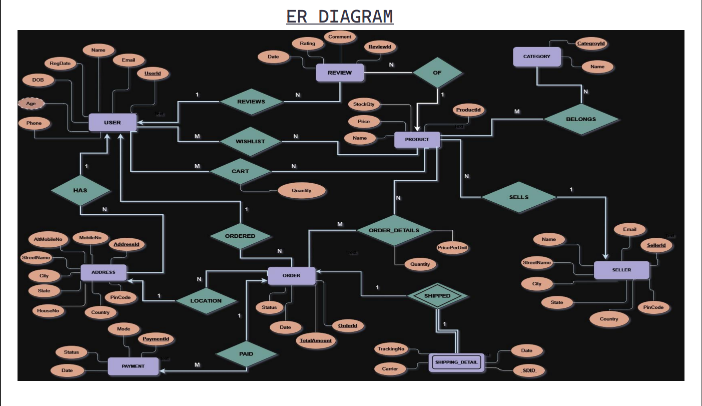
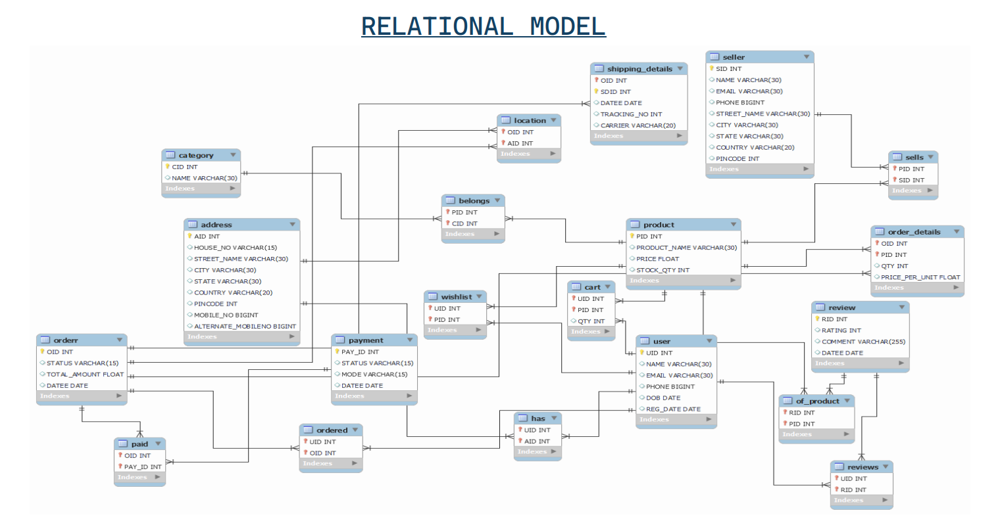

# E-Commerce-DB

### 1. ER Diagram  
Shows the overall structure of the database with entities and their attributes.  

### 2. Relationship Model  
Illustrates how different entities are connected through primary and foreign key relationships.  

